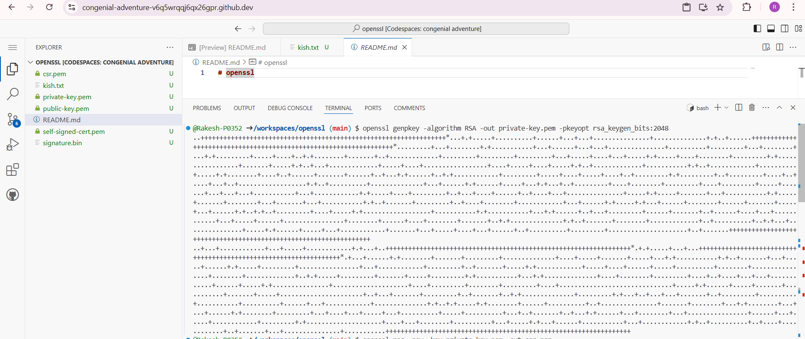
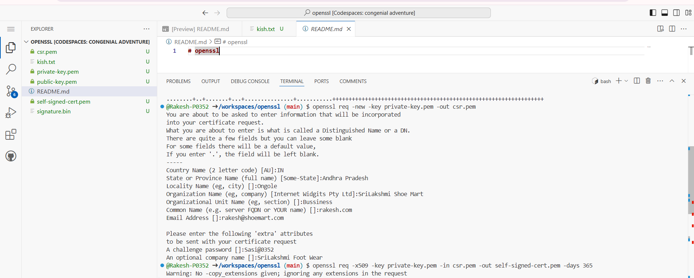
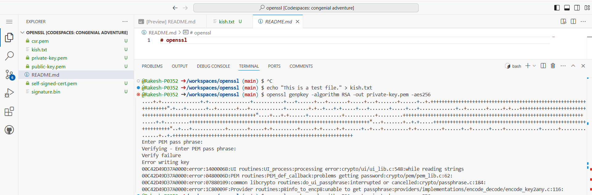
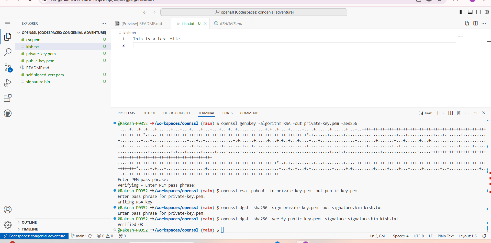

# openssl

 
 
 

# To generate a self-signed certificate and use it to sign a file with OpenSSL, you can follow these steps:

# Step 1: Generate a Private Key
First, you need to generate a private key.

sh
openssl genpkey -algorithm RSA -out private-key.pem -pkeyopt rsa_keygen_bits:2048

# Step 2: Generate a Certificate Signing Request (CSR)
Next, generate a CSR using the private key.

sh
openssl req -new -key private-key.pem -out csr.pem

# Step 3: Generate a Self-Signed Certificate
Now, create a self-signed certificate.

sh
openssl req -x509 -key private-key.pem -in csr.pem -out self-signed-cert.pem -days 365

# Step 4: Sign a File
Finally, use the private key to sign a file.

sh
openssl dgst -sha256 -sign private-key.pem -out signature.bin file-to-sign.txt
S
# tep 5: Verify the Signature
To verify the signature, use the public key from the self-signed certificate.

sh
openssl dgst -sha256 -verify <(openssl x509 -in self-signed-cert.pem -pubkey -noout) -signature signature.bin file-to-sign.txt